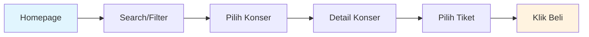
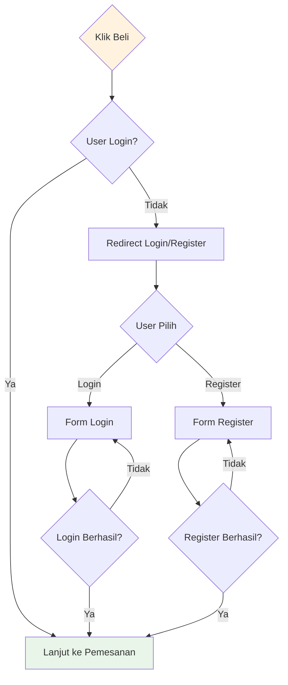
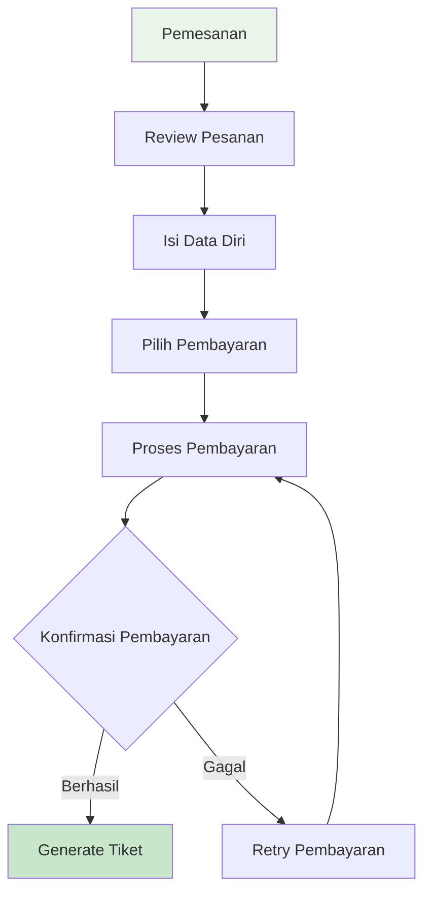
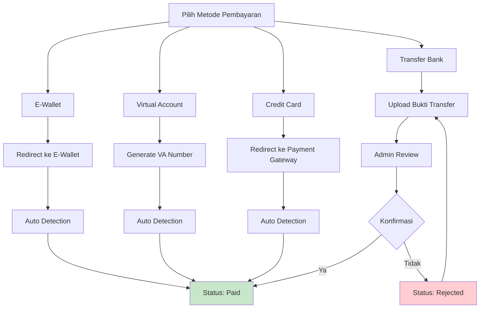
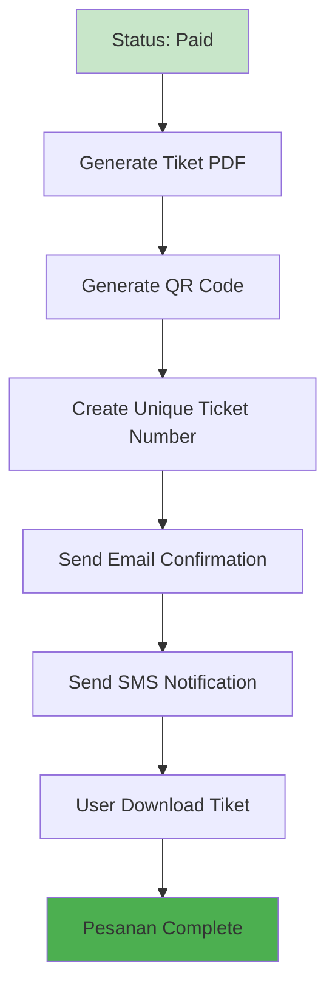
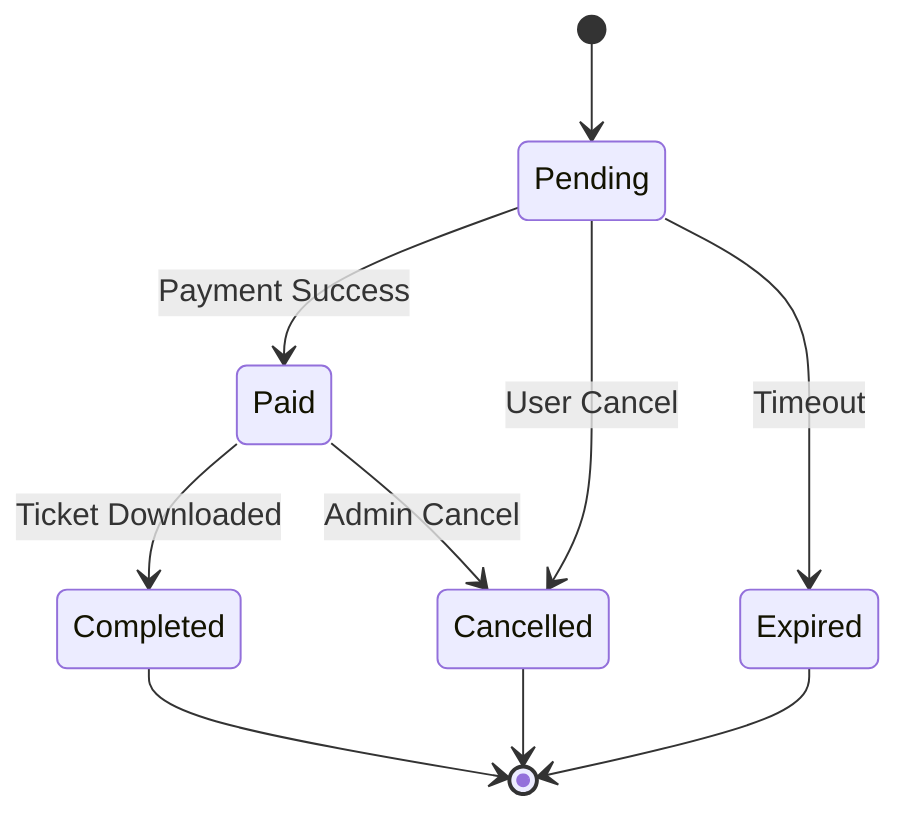
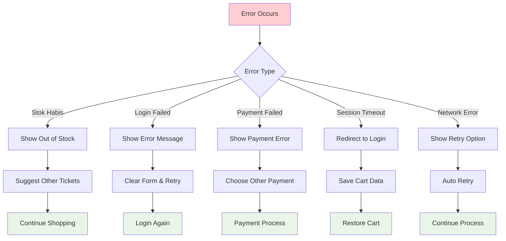

# Activity Diagram - Flow Pembelian Tiket Konser

```mermaid
flowchart TD
    A[User Buka Website] --> B[Browse Konser]
    B --> C[Pilih Konser]
    C --> D[Lihat Detail Konser]
    D --> E[Pilih Tiket & Jumlah]
    E --> F{Klik Beli}
    F --> G{User Login?}
    
    G -->|Tidak| H[Redirect ke Login/Register]
    H --> I{User Pilih}
    I -->|Login| J[Form Login]
    I -->|Register| K[Form Register]
    
    J --> L{Login Berhasil?}
    L -->|Ya| M[Redirect ke Pemesanan]
    L -->|Tidak| J
    
    K --> N{Register Berhasil?}
    N -->|Ya| M
    N -->|Tidak| K
    
    G -->|Ya| M
    
    M --> O[Halaman Pemesanan]
    O --> P[Review Pesanan]
    P --> Q[Isi Data Diri]
    Q --> R[Klik Lanjut ke Pembayaran]
    
    R --> S[Halaman Checkout]
    S --> T[Pilih Metode Pembayaran]
    T --> U[Klik Bayar Sekarang]
    
    U --> V[Generate Nomor Pembayaran]
    V --> W[User Lakukan Pembayaran]
    W --> X{Sistem Deteksi Pembayaran}
    
    X -->|Otomatis| Y[Status: Pembayaran Berhasil]
    X -->|Manual| Z[User Upload Bukti Transfer]
    Z --> AA[Admin Review Bukti]
    AA --> BB{Admin Konfirmasi}
    BB -->|Ya| Y
    BB -->|Tidak| CC[Status: Pembayaran Ditolak]
    CC --> Z
    
    Y --> DD[Sistem Generate Tiket PDF]
    DD --> EE[Generate QR Code]
    EE --> FF[Kirim Email Konfirmasi]
    FF --> GG[Kirim SMS Notifikasi]
    GG --> HH[User Download Tiket]
    HH --> II[Pesanan Selesai]
    
    style A fill:#e1f5fe
    style II fill:#c8e6c9
    style CC fill:#ffcdd2
```

## Detail Flow Activity

### **Phase 1: Browse & Selection**

### **Phase 2: Authentication**

### **Phase 3: Checkout Process**

### **Phase 4: Payment & Confirmation**

### **Phase 5: Ticket Generation**

## Status Flow Diagram

## Error Handling Flow

## Timeline Flow

```mermaid
gantt
    title Timeline Pembelian Tiket
    dateFormat  HH:mm
    section Browse
    Buka Website    :a1, 00:00, 2m
    Pilih Konser    :a2, after a1, 5m
    Pilih Tiket     :a3, after a2, 3m
    
    section Auth
    Login/Register  :b1, after a3, 5m
    
    section Checkout
    Review Pesanan  :c1, after b1, 3m
    Pilih Pembayaran :c2, after c1, 2m
    
    section Payment
    Lakukan Pembayaran :d1, after c2, 15m
    Konfirmasi      :d2, after d1, 5m
    
    section Complete
    Generate Tiket  :e1, after d2, 2m
    Download Tiket  :e2, after e1, 2m
``` 

