# Flow Activity Admin - Website Penjualan Tiket Konser

## 1. Admin Login Flow

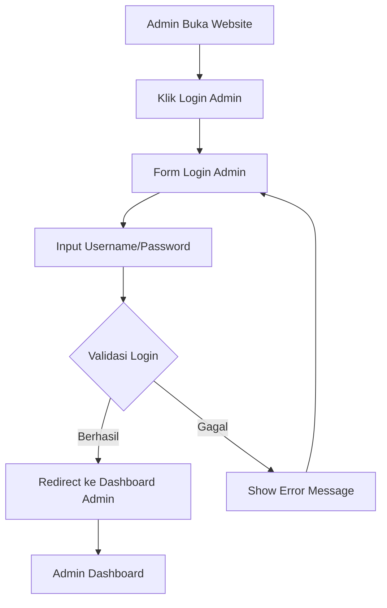

## 2. Admin Dashboard Flow

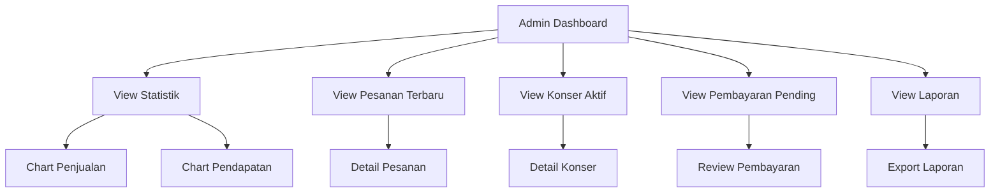

## 3. Manajemen Konser Flow

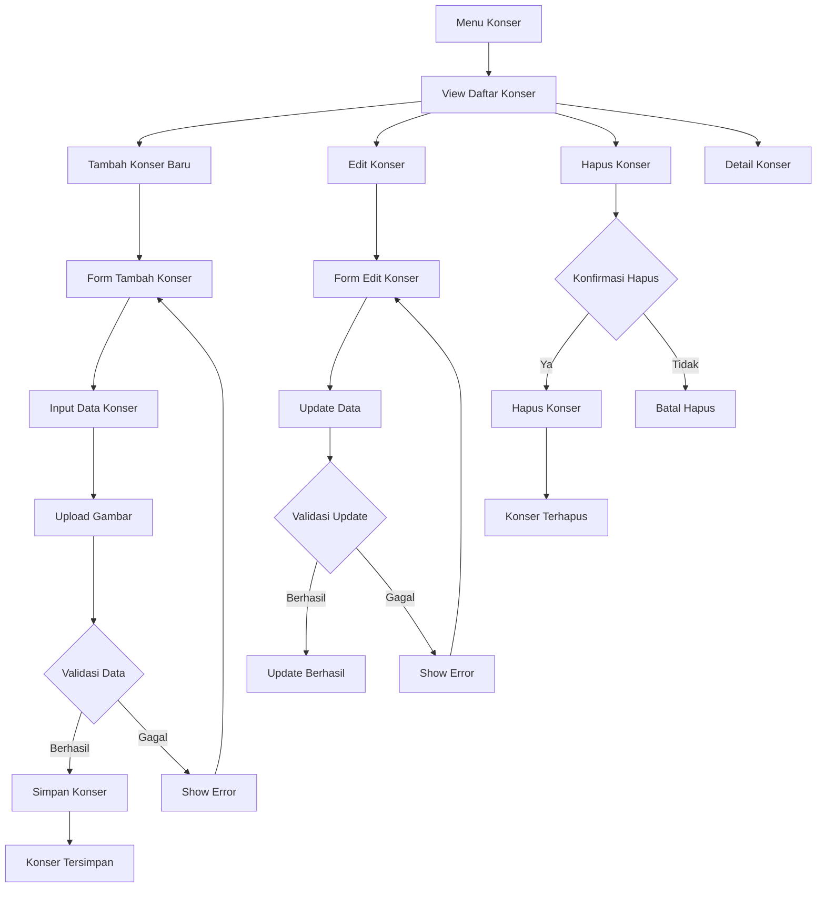

## 4. Manajemen Tiket Flow

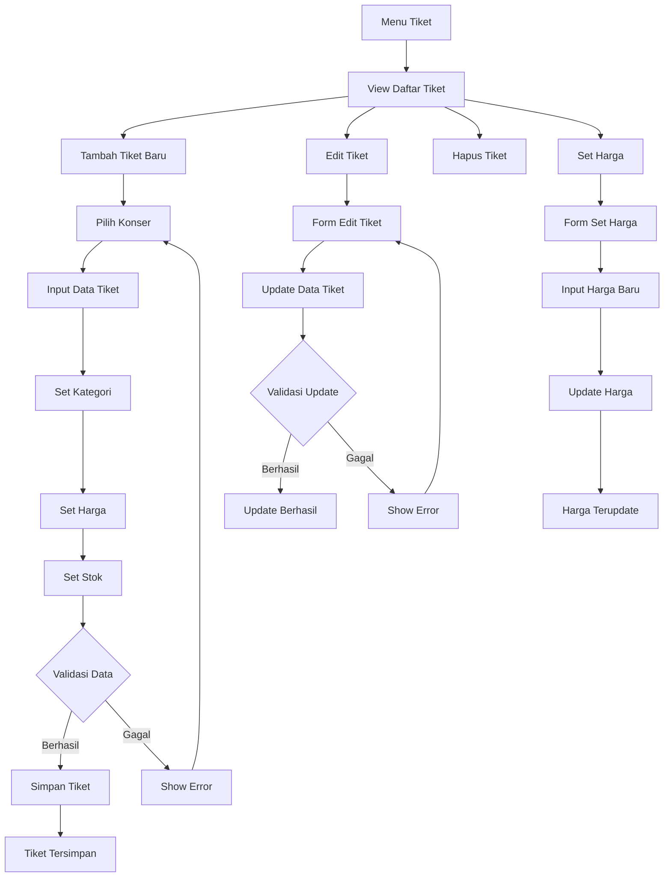

## 5. Review Pembayaran Flow

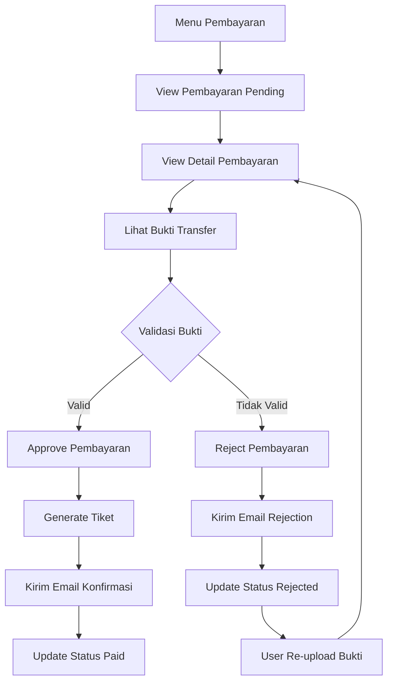

## 6. Manajemen Pesanan Flow

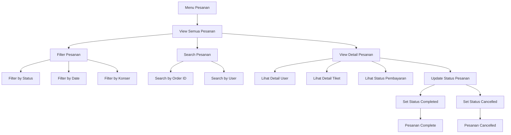

## 7. Manajemen User Flow

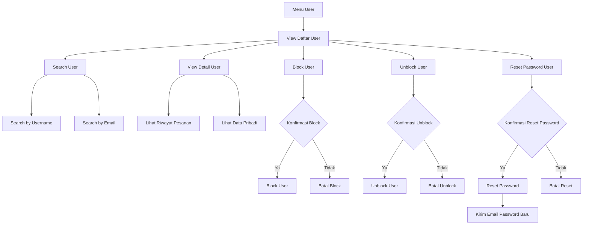

## 8. Laporan & Analytics Flow

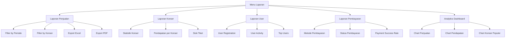

## 9. Notifikasi Admin Flow

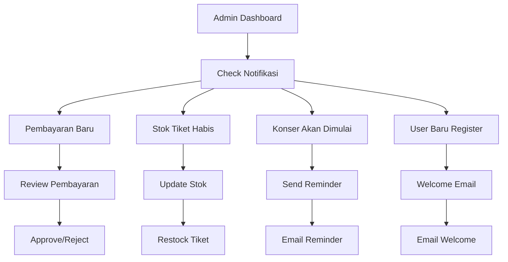

## 10. Settings Admin Flow

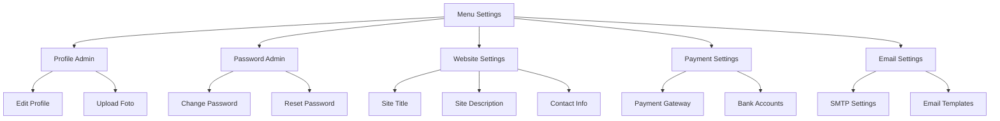

## 11. Complete Admin Workflow

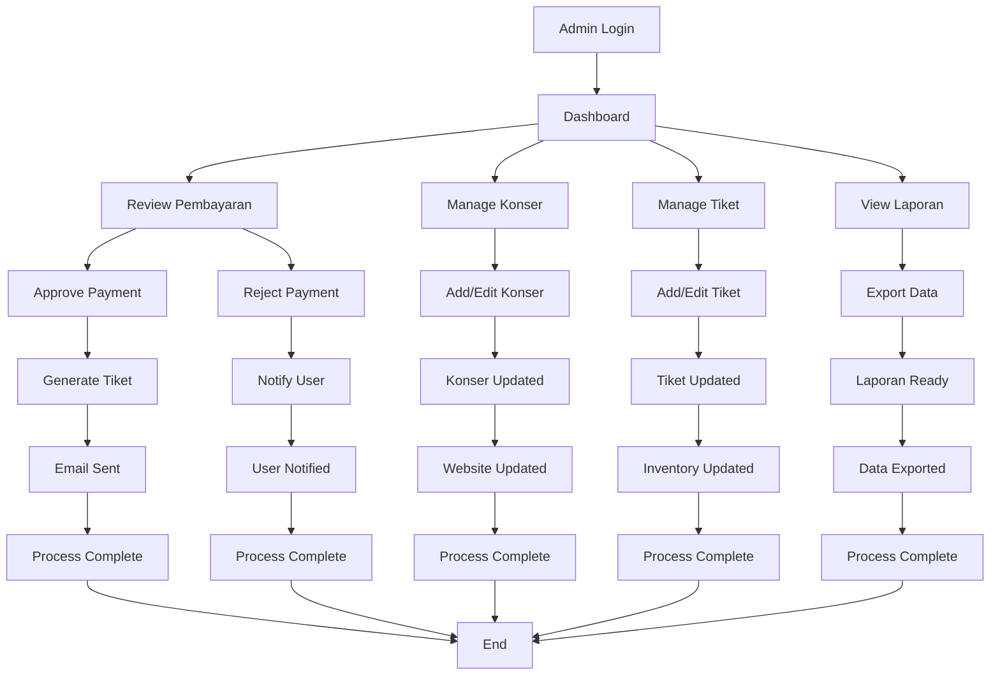

## 12. Admin Security Flow

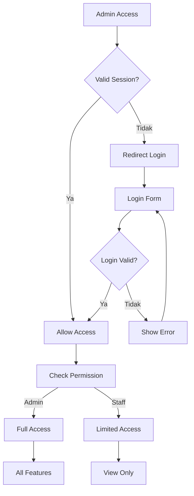