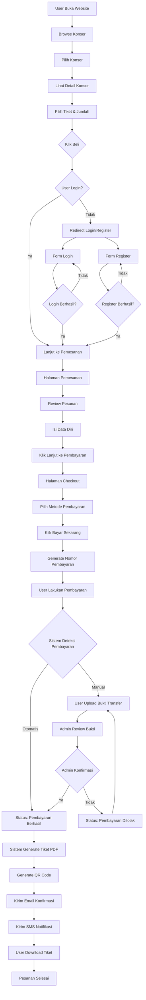
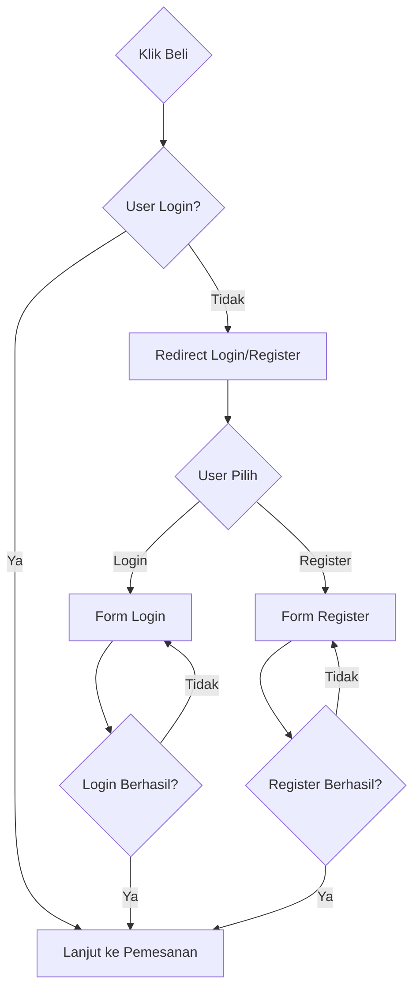
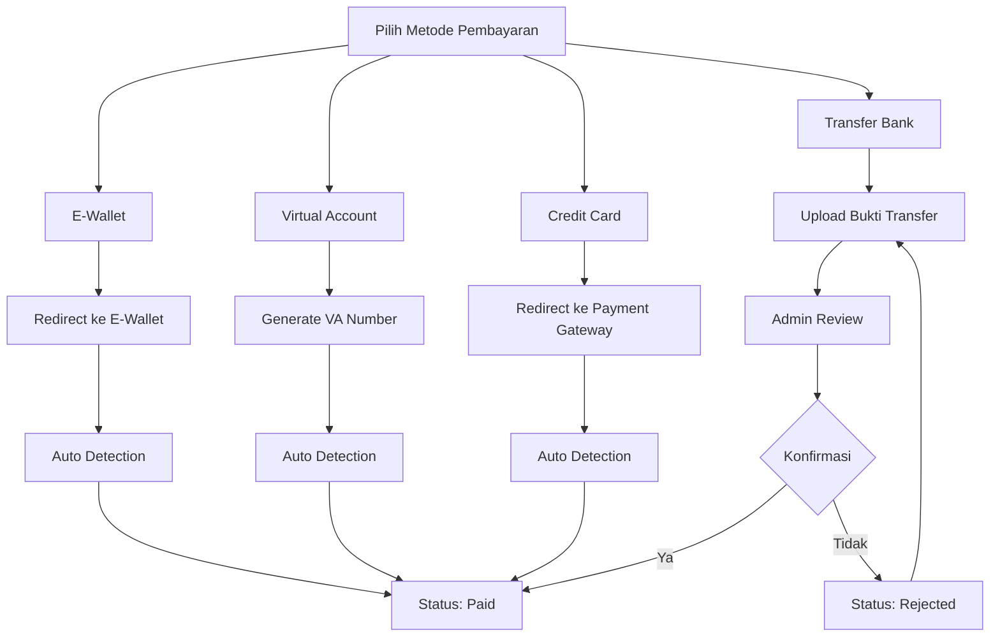
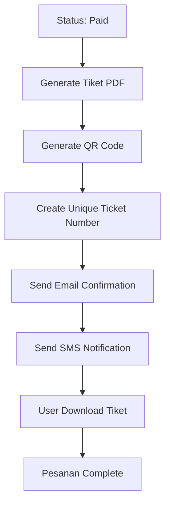
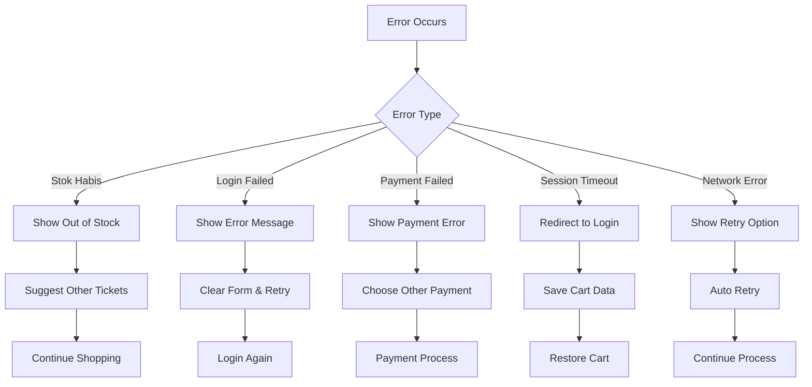
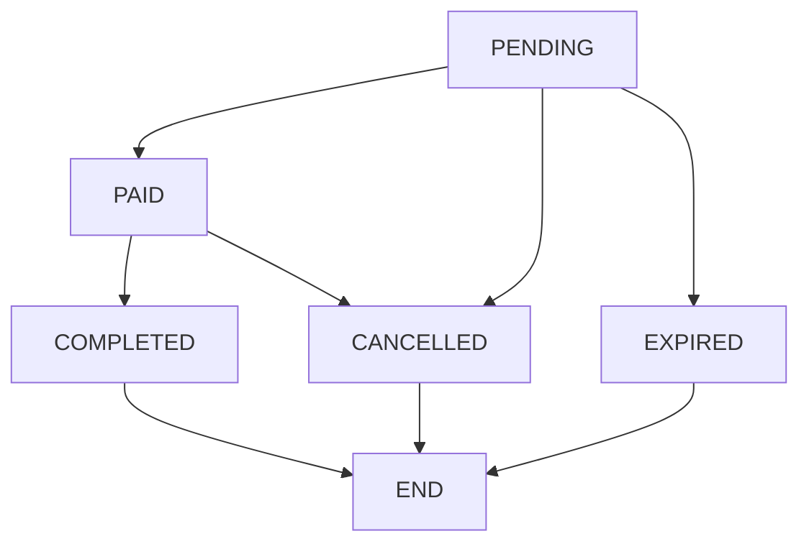
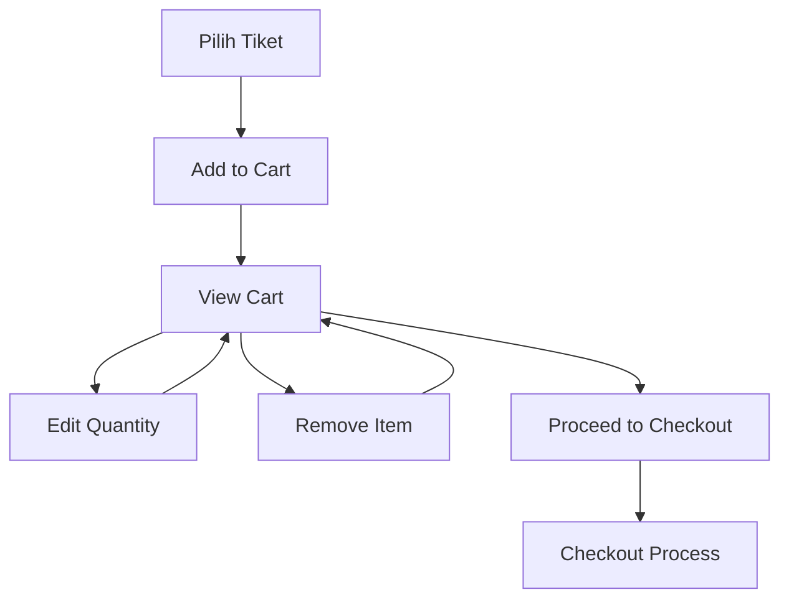
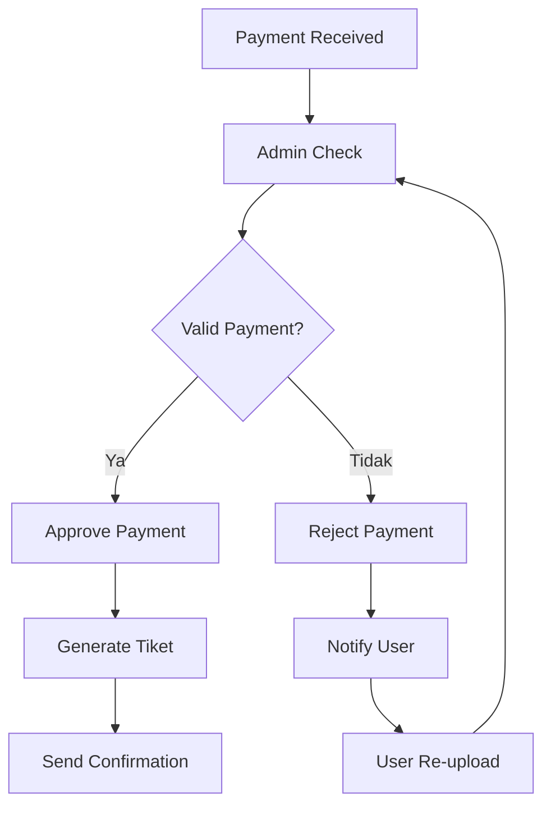
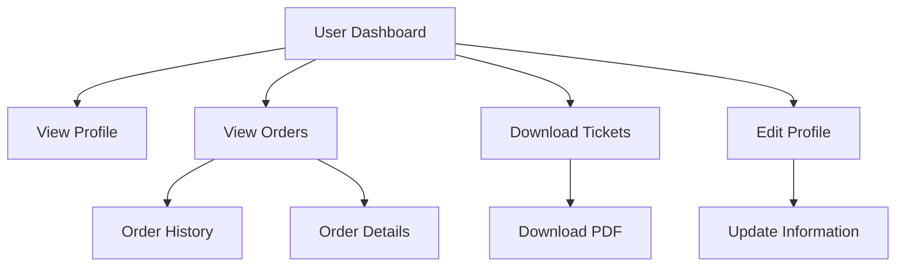
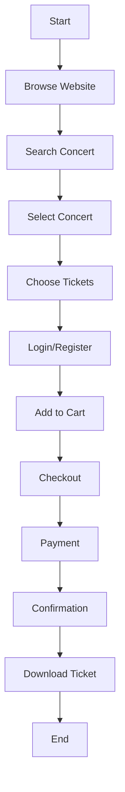

# Flow Activity Pembelian Tiket Konser (Simple Format)

## 1. Main Flow - Proses Utama

## 2. Authentication Flow

## 3. Payment Methods Flow

## 4. Ticket Generation Flow

## 5. Error Handling Flow

## 6. Status Flow

## 7. Shopping Cart Flow

## 8. Admin Review Flow

## 9. User Profile Flow

## 10. Complete User Journey

